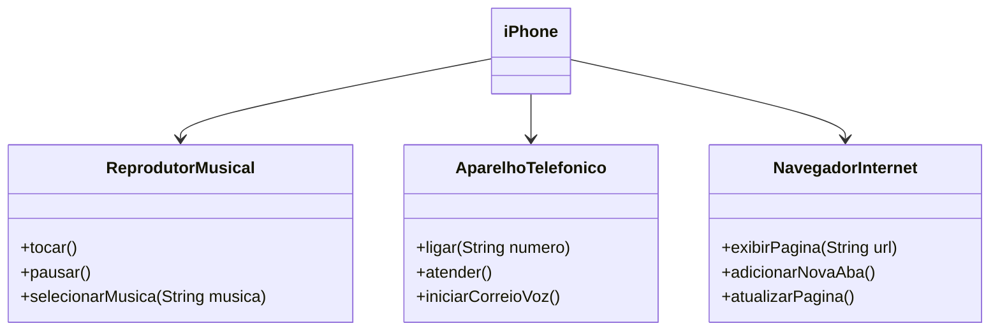

# dio-java-basico-iphone

```mermaid
classDiagram
  class iPhone {
  }

  class ReprodutorMusical {
    +tocar()
    +pausar()
    +selecionarMusica(String musica)
  }

  class AparelhoTelefonico {
    +ligar(String numero)
    +atender()
    +iniciarCorreioVoz()
  }

  class NavegadorInternet {
    +exibirPagina(String url)
    +adicionarNovaAba()
    +atualizarPagina()
  }

  iPhone --> ReprodutorMusical
  iPhone --> AparelhoTelefonico
  iPhone --> NavegadorInternet
```
